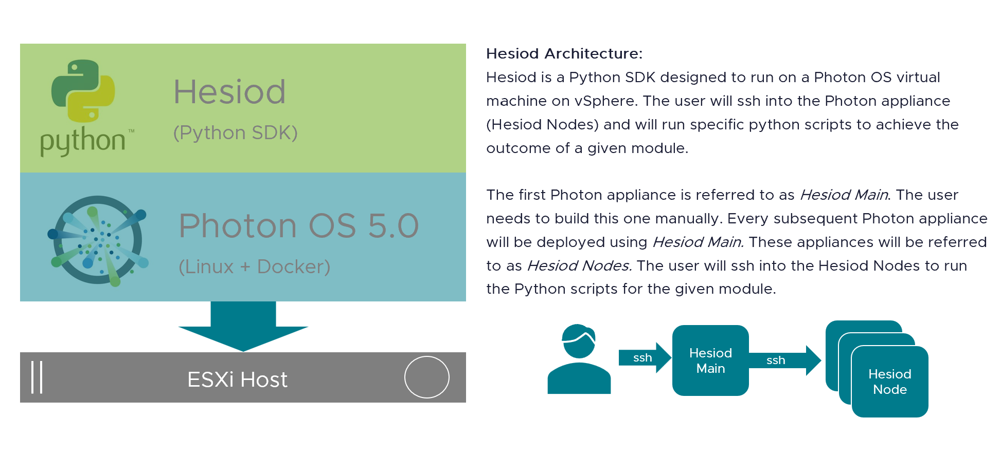

# Project Hesiod
   

The first order. Representative of the fundamental forces and physical foundations of the world. Hesiod, the ancient Greek poet (750 and 650 BC), whose work included "Theogony", told the origin story of the gods, their lineages, and the events that led to Zeus's rise to power. Hesiod is generally regarded by Western authors as a major source in Greek mythology, farming techniques, early economic thought, Archaic Greek, astronomy, cosmology, and ancient time-keeping. 

Project Hesiod is a git repository with all necessary bodies of work to begin software development. The recommended platform for Hesiod based software development is [VMware PhotonOS](https://vmware.github.io/photon/). This repository omits proprietary code or techniques for specific projects. Rather (like Hesiod's Theogony), this repository contains a body of work to facilitate the origin (i.e. the quick start) of **any** new software project. As projects begin to develop a life of their own, their source code is moved to a separate repository.

# Hesiod Architecture
   

# Prerequisite: Getting Started (Hesiod Main)
Step 1: Deploy Photon (photon-ova-X.Y-zzzzzzzzzz.ova) to your ESXi host.
For downloads visit: https://github.com/vmware/photon/wiki/Downloading-Photon-OS 

SSH into the appliance. The default password is `changeme`. For all Modules, use `/usr/local/` as the working directory.
```
cd /usr/local/
```

Step 2: Download the Install Script
```
curl https://raw.githubusercontent.com/boconnor2017/hesiod/refs/heads/main/build_hesiod_main.sh >> build_hesiod_main.sh
```

Step 3: Install the Hesiod Binaries and create Hesiod Main using the following command
```
sh build_hesiod_main.sh
```

# Deploy Hesiod Nodes
Using the Hesiod Main appliance:   

Step 1: Download or SFTP the Photon binaries (photon-ova-X.Y-zzzzzzzzzz.ova) from the link above to `/usr/local/drop`   

```
cd /usr/local/hesiod/
```

Step 2: Edit the specs in the `json/lab_environment.json` file with appropriate details. Note: you can deploy multiple Hesiod Node(s) per server with one build, but you cannot deploy to multiple servers with one build.    

Step 3: Configure PowerCLI
```
pwsh
```
```
Install-Module -Name VMware.PowerCLI
```

Step 4: Deploy Hesiod Node(s) using the following command
```
python3 hesiod-node.py -build
```